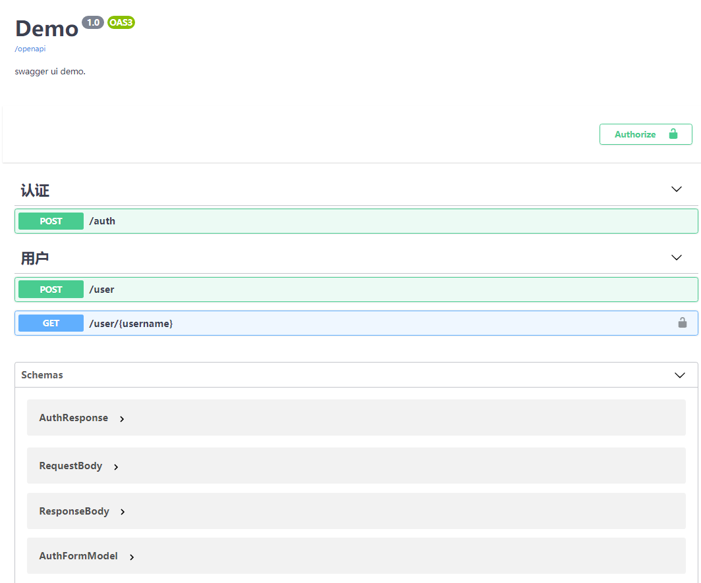

# starlette-swagger

## 1. requirements:
* starlette_openapi
* starlette_pydantic
* starlette_authentication
* python >= 3.8.5

## 2. install
```shell script
pip3 install starlette-swagger
```

## 3. usage:
### 3.1 basic use:
```python
from typing import Optional
from starlette.routing import Route
from starlette.applications import Starlette
from pydantic import BaseModel
from starlette_pydantic import PydanticEndpoint
from starlette_openapi import OpenApi
from starlette_swagger import SwaggerUI


class RequestBody(BaseModel):
    name: int


class ResponseBody(BaseModel):
    age: int


class UserDetail(PydanticEndpoint):
    tags = ["用户"]

    @staticmethod
    async def get(request, username: str = None, page: Optional[str] = None) -> ResponseBody:
        return ResponseBody(age=11)


class User(PydanticEndpoint):
    tags = ["用户"]

    @staticmethod
    async def post(request, body: RequestBody) -> ResponseBody:
        return ResponseBody(age=21)


routes = [
    Route("/user", User),
    Route("/user/{username}", UserDetail),
]

app = Starlette(routes=routes)
openapi = OpenApi(app, title="Demo", description="swagger ui demo.")
SwaggerUI(app, openapi)

if __name__ == "__main__":
    import uvicorn

    uvicorn.run("test.main:app", host="0.0.0.0", port=8000, reload=True, debug=True)

```

### 3.2 with authentication
```python
from typing import Optional
from starlette.routing import Route
from starlette.applications import Starlette
from pydantic import BaseModel, constr
from starlette_pydantic import PydanticEndpoint, BaseForm
from starlette_openapi import OpenApi
from starlette_swagger import SwaggerUI
from starlette.middleware.authentication import AuthenticationMiddleware
from starlette.middleware import Middleware
from starlette.authentication import (
    AuthenticationBackend, SimpleUser, AuthCredentials
)
from starlette_authentication.decorators import requires, token_url


class RequestBody(BaseModel):
    name: int


class ResponseBody(BaseModel):
    age: int


class AuthForm(BaseForm):
    grant_type: str
    username: constr(max_length=64, min_length=8)
    password: constr(max_length=64, min_length=8)


class AuthResponse(BaseModel):
    access_token: str
    refresh_token: Optional[str]
    token_type: str


class BearerAuthBackend(AuthenticationBackend):
    async def authenticate(self, request):
        return AuthCredentials(["authenticated"]), SimpleUser("username")


class Auth(PydanticEndpoint):
    tags = ["认证"]

    @staticmethod
    @token_url
    async def post(request, form: AuthForm) -> AuthResponse:
        return AuthResponse(access_token="access_token",
                            refresh_token="refresh_token",
                            token_type="Bearer")


class UserDetail(PydanticEndpoint):
    tags = ["用户"]

    @staticmethod
    @requires('authenticated', status_code=401)
    async def get(request, username: str = None, page: Optional[str] = None) -> ResponseBody:
        return ResponseBody(age=11)


class User(PydanticEndpoint):
    tags = ["用户"]

    @staticmethod
    async def post(request, body: RequestBody) -> ResponseBody:
        return ResponseBody(age=21)


routes = [
    Route("/auth", Auth),
    Route("/user", User),
    Route("/user/{username}", UserDetail),
]

middleware = [
    Middleware(AuthenticationMiddleware, backend=BearerAuthBackend())
]

app = Starlette(routes=routes, middleware=middleware)
openapi = OpenApi(app, title="Demo", description="swagger ui demo.")
SwaggerUI(app, openapi)

if __name__ == "__main__":
    import uvicorn

    uvicorn.run("test.main:app", host="0.0.0.0", port=8000, reload=True, debug=True)

```

docs url: `http://IP:PORT/docs`


